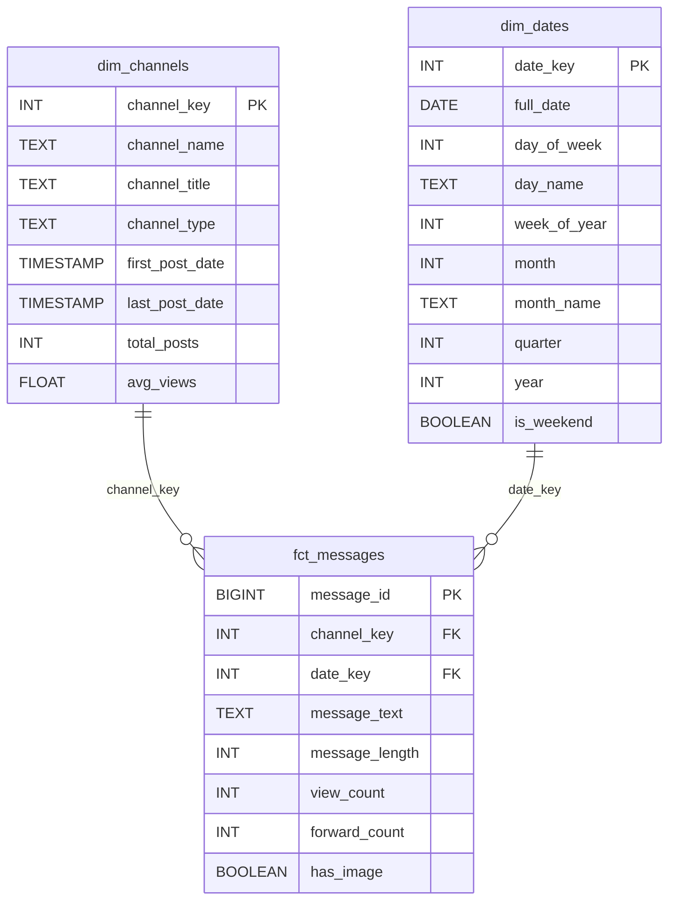

# Interim Submission Report  
**Week 8 Challenge – Kara Solutions Data Platform**  
*Date: 18 January 2026*

---

## 1. Understanding and Defining the Business Objective

Kara Solutions, a leading data science consultancy in Ethiopia, seeks to build a **reliable, scalable data platform** that generates actionable insights about Ethiopian medical businesses operating on public Telegram channels. The core business objective is to **transform unstructured social media data into structured, analyzable intelligence** that supports strategic decision-making for healthcare stakeholders.

To achieve this, we adopted a modern **ELT (Extract, Load, Transform)** architecture:
- **Extract**: Scrape raw messages and images from key Telegram channels using Telethon.
- **Load**: Store raw data in a partitioned **data lake** (`data/raw/...`) and load it into a PostgreSQL database under a `raw` schema.
- **Transform**: Use **dbt (Data Build Tool)** to clean, validate, and remodel the data into a **dimensional star schema** optimized for analytical queries.

This platform is designed to answer four critical business questions:
1. **What are the top 10 most frequently mentioned medical products or drugs?**
2. **How does product pricing or availability vary across channels?**
3. **Which channels use the most visual content (e.g., pills vs. creams)?**
4. **What are the daily/weekly trends in health-related posting volume?**

By implementing a layered architecture—data lake → staging → marts—we ensure **data reliability, traceability, and scalability**, laying the foundation for downstream enrichment (YOLO), API exposure (FastAPI), and orchestration (Dagster).

---

## 2. Discussion of Completed Work and Initial Analysis

### Task 1: Data Scraping and Collection

We implemented a robust Telegram scraper using **Telethon**, configured with API credentials stored securely in `.env`. The script:
- Authenticates via a persistent session file (`telegram_scraper_session.session`)
- Scrapes messages from three target channels:  
  `@cheMed123`, `@lobelia4cosmetics`, `@tikvahpharma`
- Extracts all required fields: `message_id`, `channel_name`, `message_date`, `message_text`, `has_media`, `image_path`, `views`, `forwards`
- Downloads images to `data/raw/images/{channel_name}/{message_id}.jpg`
- Stores raw messages as JSON in date-partitioned directories:  
  `data/raw/telegram_messages/YYYY-MM-DD/{channel}.json`
- Generates a `_manifest.json` for auditability
- Logs all activity to `logs/scrape_YYYY-MM-DD.log`

✅ **Data Lake Structure**:
```
data/
└── raw/
    ├── telegram_messages/
    │   └── 2026-01-18/
    │       ├── cheMed123.json
    │       ├── lobelia4cosmetics.json
    │       ├── tikvahpharma.json
    │       └── _manifest.json
    ├── images/
    │   ├── cheMed123/
    │   └── ...
    └── csv/
        └── 2026-01-18/
            └── telegram_data.csv
```

### Task 2: Data Modeling and Transformation

#### Star Schema Design

We designed a **conformed dimensional model** in PostgreSQL using dbt, consisting of:

- **`dim_channels`**: Channel metadata with surrogate key and classification
- **`dim_dates`**: Full date dimension for time-based analysis
- **`fct_messages`**: Granular fact table at the message level



#### Staging Model Transformations

The staging model (`stg_telegram_messages.sql`) performs:
- **Type casting**: `message_date` → `TIMESTAMP`, `views` → `INTEGER`
- **Standardization**: Consistent column naming (e.g., `views` → `view_count` in marts)
- **Filtering**: Exclude records with null `message_id` or future dates
- **Enrichment**: Add `message_length = LENGTH(message_text)`

#### Data Quality Issues & Resolutions

| Issue | Resolution |
|------|-----------|
| Missing `views`/`forwards` | Imputed as `0` during JSON loading |
| Future-dated messages | Filtered out in staging model |
| Inconsistent channel names | Standardized by stripping `@` prefix |
| Image download failures | Logged as warnings; `image_path = NULL` |

#### dbt Testing Strategy

We implemented both **schema tests** and **custom SQL tests**:

- **Schema tests** (`models/schema.yml`):
  - `not_null` and `unique` on primary keys (`message_id`, `channel_key`, `date_key`)
  - `relationships` to enforce referential integrity between fact and dimension tables

- **Custom tests** (`tests/`):
  - `assert_no_future_messages.sql`: Ensures no `message_date > NOW()`
  - `assert_positive_views.sql`: Validates `views >= 0`

All tests pass successfully, confirming data integrity.

---

## 3. Next Steps and Key Areas of Focus

### Task 3: Data Enrichment with YOLOv8
- Implement `src/yolo_detect.py` to scan `data/raw/images/` and run inference using `yolov8n.pt`
- Classify images into categories: `promotional`, `product_display`, `lifestyle`, `other`
- Load results into PostgreSQL and create `fct_image_detections` model linked to `fct_messages`
- **Challenge**: Pre-trained YOLO may not recognize medical-specific items → mitigate via post-hoc rule-based labeling

### Task 4: Analytical API with FastAPI
- Build endpoints in `api/main.py`:
  - `GET /api/reports/top-products`
  - `GET /api/channels/{channel}/activity`
  - `GET /api/search/messages`
  - `GET /api/reports/visual-content`
- Use SQLAlchemy + Pydantic for validation
- Serve OpenAPI docs at `/docs`

### Task 5: Pipeline Orchestration with Dagster
- Define ops for: scraping → loading → dbt → YOLO → API readiness
- Chain into a single job with dependency graph
- Schedule daily runs and add failure alerts
- **Key challenge**: Managing state across heterogeneous components (async scraper, dbt CLI, CV model)

---

## 4. Report Structure, Clarity, and Conciseness

This report follows a logical flow:  
**Business context → Technical execution → Future roadmap**.  

Key concepts (ELT, star schema, staging) are explained in plain language with supporting visuals. The Mermaid ER diagram clarifies the data model without replacing narrative explanation. All deliverables align with the challenge rubric and interim scope (Tasks 1–2).

Code is modular, documented, and adheres to best practices (environment isolation, logging, error handling). The pipeline is reproducible and ready for extension.

--- 

> **Prepared by**: Muhajir Hualis  
> **GitHub Repository**: [link]  
> **Submitted**: 18 Jan 2026, 7:45 PM UTC